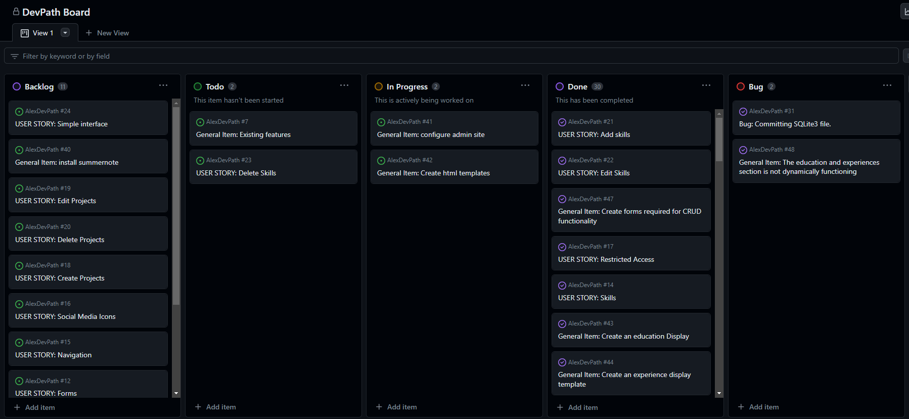
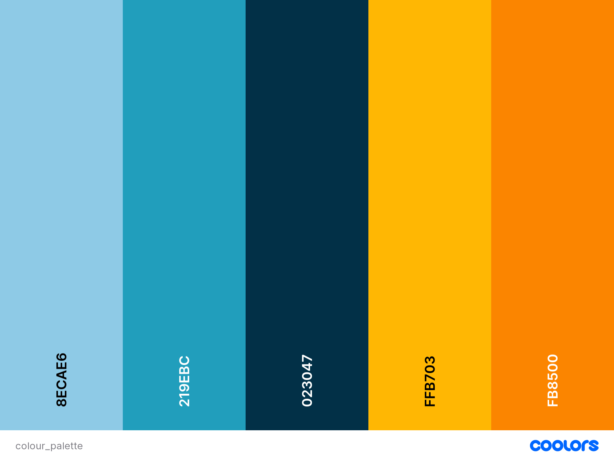
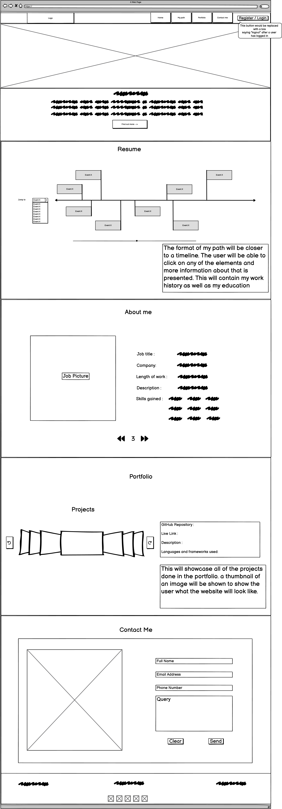
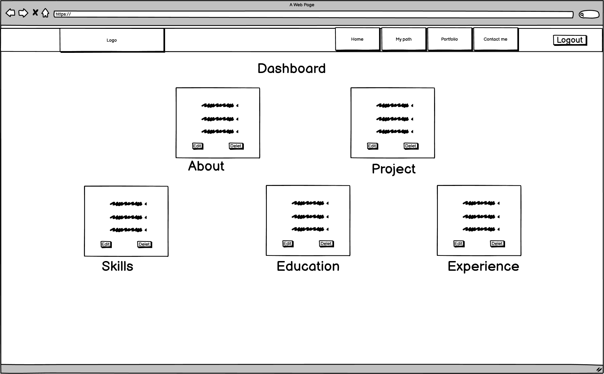
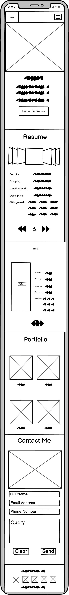
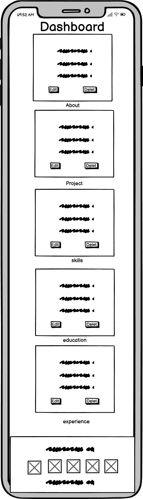
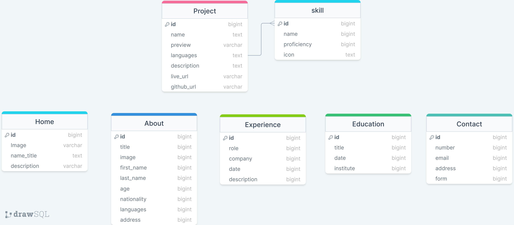

# Alex's Dev Path

## Introduction
Alex's Dev Path is a full stack website developed to show off my path into coding, my skills, portfolio and a user interface for users to link with myself.

The website allows an administrator or staff to login using a pre-registered login, from there, the users can create, read, update and delete projects, skills and much more. This responsive website was created using agile principles, bootstrap and the django frameworks. This website also allows a guest to get in contact with myself for hiring me or potentially to work with me in a project.

## Agile Methodologies
As mentioned in the introduciton, agile principles were utilised throughout this project to plan and complete all aspects of the project. The agile method that was mainly utilised in this project was the use of GitHub issues which were further categorised into milestones and epics to seperate out tasks for various aspects of the project. The issues were then added onto a Kanban project board through GitHub as shown below: 

The main GitHub issues laid out were user stories, each user stories contains acceptance criteria. These requirements were sometimes adjusted as through the course of the project, unplanned events and new ideas occurred therefore this was added or deleted as required. Throughout development, I was able to learn more about how Django works and its capabilities and therefore more user stories were added to improve the usability of the website.

Another agile principle used was the MoSCoW method. The MoSCoW prioritisation method enabled me to understand what elements within the project were 'must haves', 'should have', 'could have' and more. This allowed me to make sure that I spent the most amount of time ensuring that the must haves were completed first. This aided development as the fundamentals were created first in order to be able to alter them by styling or by a change of mind at a later stage with ease.

## User Experience (UX)

### Site Owner Goals

- I would like the user to be able to understand what the website is about straight away from the home page.
- A form is required whereby the user can send me a message for any enquiries.
- Validation is required throughout to provide users with any feedback required.
- I can review the database to manage user's forms.
- A staff/admin login for myself and staff to manage CRUD functionality for new projects, skills, experience and education.  
- Professional and modern design. 

### User (guest) Stories

- As a user, I expect every web page to be consistent with the same header and footer. [#9](https://github.com/AlexAntony3/AlexDevPath/issues/9)
- As a user, I want to be able to see the work history of the Alex. [#49](https://github.com/AlexAntony3/AlexDevPath/issues/49)
- As a user, I want to be able to see a picture of Alex with a short description about himself. [#50](https://github.com/AlexAntony3/AlexDevPath/issues/50)
- As a user, I want to be able to see the projects Alex has completed. [#55](https://github.com/AlexAntony3/AlexDevPath/issues/51)
- As a user, I want to be able to contact Alex with a message. [#51](https://github.com/AlexAntony3/AlexDevPath/issues/51)
- As a user, I want to be able to see Alex's skill set. [#14](https://github.com/AlexAntony3/AlexDevPath/issues/14)
- As a user, I expect an easily navigatable web page that is simple. [#24](https://github.com/AlexAntony3/AlexDevPath/issues/24)
- As a user, I want to be able to see skills, proficincies and icons. [#56](https://github.com/AlexAntony3/AlexDevPath/issues/51)
- As a user, I expect to be able to follow Alex on social media through the footer. [#16](https://github.com/AlexAntony3/AlexDevPath/issues/16)

### Staff Member Stories

- As a staff member, I want to have a higher access account compared to the user. [#17](https://github.com/AlexAntony3/AlexDevPath/issues/17)
- As a staff member, I want to be able to add any new project to the website. [#18](https://github.com/AlexAntony3/AlexDevPath/issues/18)
- As a staff member, I want to be able to edit any project to the website. [#19](https://github.com/AlexAntony3/AlexDevPath/issues/19)
- As a staff member, I want to be able to delete any project to the website. [#20](https://github.com/AlexAntony3/AlexDevPath/issues/20)
- As a staff member, I want to be able to add any new skills to the website. [#14](https://github.com/AlexAntony3/AlexDevPath/issues/14)
- As a staff member, I want to be able to edit any skills to the website. [#14](https://github.com/AlexAntony3/AlexDevPath/issues/14)
- As a staff member, I want to be able to delete any skills to the website. [#23](https://github.com/AlexAntony3/AlexDevPath/issues/23)   
- As a staff member, I expect the interface to be simple to use. [#24](https://github.com/AlexAntony3/AlexDevPath/issues/24)
- As a staff member, I want to be able to have full CRUD functioanlity for the education section. [#52](https://github.com/AlexAntony3/AlexDevPath/issues/52)
- As a staff member, I want to be able to have full CRUD functioanlity for the Experience section. [#53](https://github.com/AlexAntony3/AlexDevPath/issues/53)
- As a staff member, I want to be able to have edit functioanlity for the about section. [#54](https://github.com/AlexAntony3/AlexDevPath/issues/54)

### Developer Goals

- The site should restrict users from entering invalid data into forms 
- The form must contain placeholder text in all fields to make it easier for the user to use.
- A notification must appear when a user has logged out.
- The website is viable and accessible on all browsers.
- The website attractive and different when compared to other portfolio websites to make it stand out.
- The website is responsive to multiple different size screens.

### Expectations

- I expect there to be confirmations and notifications of CRUD functionality.
- I expect there to be restrictions as to the limit of what a guest user can do.
- I expect there to be less restriction as to the limit of what a staff member/admin can do.

### Requirements

- The website must be intuitive to use.
- The website must be unique and entice the user to stay.
- Any errors must display and allow the user to understand why the error occurred.
- The website must be responsive to all screen sizes.
- The colour pallette must be consistent all the way through.

## Design & Structure

The design aspect of the website is a challenging topic as I religiously use pastel colours which I have seen to not be a great hit when it comes to enticing a user to stay in the website and also to make it stand out the crowd. For this reason, I completed a questionnaire which was completed by my collegues and friends to see what colour scheme they would prefer to see in a portfolio related page. The design choices laid ahead are the decisions made from the answers in the questionnaire. 

For the structure of the page, I reviewed multiple portfolio websites to see what elements really stood out and what I liked. I observed that there were multiple different styles of portfolios and decided to pick specifics from each one, a standout item for me was the use of a carousel for projects and testimonials. This puts a fun twist on a generically observed card display of projects. It further encourages users to engage with the website. 

Finally and mainly the CRUD functionality is what is required for a fully dynamic website. After thorough research, I found that dashboards with the use of tables allowed for a more user friendly interface. The Staff member(s) that will be authorised to run the website will be able to easily navigate through and only be able to edit/view/delete/create within restriction. 

### Colour Scheme

The interview questions feedback gained meant that the following colour scheme was selected. The main properties to be concerned about with the colour scheme was the fact that the text colour is required to contrast against the background so that all text is legible. Another property to be mindful was to also try and avoid only using pastel colours and make sure that the colour scheme is modern. The colour scheme below was generated using [Coolors](https://coolors.co/?home "Coolors")

| Colour (Hex) | Use |
|--|--|
|#8ECAE6|The lightest of all the colours in the palette, this colour is used for the minor elements such as the border for images. |
|#219EBC|This is the second shade of blue that is used in this webpage. It is to be used as contrasting text colour when compared to the other orange colours used.|
|#023047|This final blue shade is the darkest and also the main colour scheme of the website, this colour will be used primarily as the background colour.|
|#FFB703|This initial shade of yellow is used for contrasting text colour when a blue background is present.|
|#FB8500|This is the second main colour in the webpage, this colour is primarily used as the pop out colour from the background. This colour will be used to display important information and draw the users eyes to it.|

### Icons

Multiple icons are used throughout the webapge, this is to increase the user experience and make the purpose of buttons / information sources easier to understand. [Font Awesome](https://fontawesome.com/ "Font Awesome") was used as the source of the icons.
[Favicon](https://favicon.io "Favicon") was also another source of icon used however this supplied an identifier for the website when a user visits. The icon is recognisable and is indicative of the type of website.

### Font

As the webpage is designed to show my professional and educational life, it was important to show where my current path has led and to reflect that, the fonts that were decided on were: 
* Source Code Pro is the main font for all text within the website, this portrays a coding stlye making it relevant to the website purpose. Furthermore the readability of the font is clear and spaced out well.
* Kanit is the other font used in the project, this font is to be used for all titles and the logo. It is a clear bold font and it stands out from the page. 

### Breakpoints

For breakpoints within this website, there were some minor aspects using media queries however the vast majority of the breakpoints were controlled using bootstrap elements. The main requirement of the breakpoints were to set a limit, that being that as per bootstrap documentation, the minimum size the website must be functional and responsive to is 320px.

### Wireframes

My initial ideas after research was sketched out using [Balsamiq](https://balsamiq.com/wireframes/). This was an effective method as I was able to gather my ideas and see which worked best. However, when completing the project, I noticed myself not likig my inital proposed ideas and changing to different ideas. However the general structure of the wireframes have been reflected in the final design. 

Large Screens
 

Small Screen
 

## Database Structure

To develop the database schema, i used [DrawSQL](https://drawsql.app/). I was able to visualise what fields linked with what fields using this, however as I'm completing a portfolio website there was only one relationship that was possible to be built. That relationship was a many to many relation of the skills to the project. This is because many projects can have many skills associated to them and vice versa. 

### Home Model

|     Field Name    |       Type      |         Default Value        |
|:-----------------:|:---------------:|:----------------------------:|
|       title       |    CharField    | (max_length=200, blank=True) |
|     main_image    | CloudinaryField |           ('image')          |
|    name_header    |    CharField    |       (max_length=100)       |
| intro_description |    TextField    |              ()              |

### About Model

|  Field Name  |       Type      |         Default Value         |
|:------------:|:---------------:|:-----------------------------:|
|     title    |    CharField    |  (max_length=50, blank=True)  |
| second_image | CloudinaryField |           ('image')           |
|  first_name  |    CharField    |  (max_length=80, unique=True) |
|   last_name  |    CharField    |  (max_length=80, unique=True) |
|      age     |   IntegerField  |    (null=True, blank=True)    |
|  nationality |    CharField    |        (max_length=200)       |
|   languages  |    CharField    |        (max_length=200)       |
|    address   |    CharField    | (max_length=400, unique=True) |

### Project Model

|  Field Name |       Type      |         Default Value         |
|:-----------:|:---------------:|:-----------------------------:|
|     name    |    CharField    | (max_length=100, unique=True) |
|  thumbnail  | CloudinaryField |           ('image')           |
|    skills   | ManyToManyField |           ('Skill')           |
| description |    TextField    |               ()              |
|   live_url  |     URLField    |               ()              |
|  github_url |     URLField    |               ()              |

### Skill Model

|  Field Name |       Type      |   Default Value  |
|:-----------:|:---------------:|:----------------:|
|     name    |    CharField    | (max_length=100) |
| proficiency |   IntegerField  |        ()        |
|     icon    | CharField |     (max_length=100)    |

### Experience Model

|  Field Name |    Type   |   Default Value  |
|:-----------:|:---------:|:----------------:|
|     role    | CharField | (max_length=200) |
|   company   | CharField | (max_length=300) |
|  start_date | DateField |        ()        |
| description | TextField |        ()        |

### Education Model

|   Field Name  |    Type   |      Default Value      |
|:-------------:|:---------:|:-----------------------:|
|   institute   | CharField |     (max_length=200)    |
| qualification | CharField |     (max_length=200)    |
|   start_date  | DateField |            ()           |
|  description  | TextField | (null=True, blank=True) |

### Contact Model

| Field Name |    Type    |   Default Value  |
|:----------:|:----------:|:----------------:|
|  full_name |  CharField | (max_length=200) |
|   number   |  CharField |  (max_length=16) |
|    email   | EmailField |        ()        |
|   message  |  TextField |        ()        |

## Existing Features

### Header and Navigation Bar

* The header and navigation bar are elements that stay consistent throughout the project. This provides the user with a better user experience and allows them keep engaged within the website.

* The header and navigation bar consists of a logo that was created using [Photopea](https://www.photopea.com/). The main thing noted is that the colour scheme is closely followed and the hovering feature also follows the same tones for consistency and as they are contrasting colours, it stands out of the page.

* The key hidden functionality of the nav bar is that when a user is logged in as a staff, the nav bar changes so that they can have access to the dashboard and also gives them an option to log out if they want to. This feature is implemented using a drop down that is intuitive and easy to use.

* The header and navigation bar is also dynamic as in lower screen sizes the hamburger icon appears and the navbar drops vertically which is the industry standard. 

**Large Screen Header**
[add header photo here]

**Staff Large Screen Header**
[add staff header photo]

**Small Screen Header**
[add small screen header]

**Small Staff Screen Header**
[add small staff screen header]

**Post Logout**
[add post logout screen]

### Home Screen

* The home screen contains a brief introduction into who I am, a little bit of my experience, and an avatar picture. This was something else I noted was very popular among other developers when creating a portfolio.

* The main element noted in the home screen is the bright background which contrasts heavily against the navigation bar and the next section. A pattern is included within the background so that more intricasy is introduced into the webise. 

**Home Screen Large**
[add home screen here]

**Home Screen Small**
[add home screen here]

## Technologies Used

### Languages

* HTML
* CSS
* Python

### Libraries and Frameworks

### Tools

* GitPod
* GitHub
* Git

## Deployment

One of the first and most important things to do in the project, is to deploy to heroku. This prevents any unexpected errors to appear and makes life a lot easier. 

Once the Django project is created after all supporting libraries are installed, I migrated the database. It is important to note only add sufficient items for you to be able to verify that the logic works as expected as you may want to update the models later on in the project. 

The database used within the workspace environment is db.sqlite3. As this cannot be used when deployed to Heroku, a new database is required for production. Heroku offers postgreSQL as a database management system which can be utilised using ElephantSQL (it's free!)

### Installing Django and supporting libraries

To install Django and gunicorn, enter the following into the terminal:

    pip3 install 'django<4' gunicorn
To install the supporting libraries, enter the following into the terminal:

    pip3 install dj_database_url==0.5.0 psycopg2
To install Cloudinary libraries, enter the following into the terminal:

    pip3 install dj3-cloudinary-storage
    pip3 install urllib3==1.26.15
Create a requirements file

    pip3 freeze --local > requirements.txt
Create Project:

    django-admin startproject **Project name goes here**.
Create App:

    python3 manage.py startapp **App name goes here**

### Heroku

* **Log in** to your [Heroku](https://www.heroku.com/  "Heroku") account or **sign up** if it's your first time.
* Activate the Heroku Student Pack as per the instructions on the **Deployments module** in the Love Sandwiches project.
* On the home page, click the **Create new app** button.
* Write an **App name** that is unique, the input bar validation will guide you if the app name has been used before or is available.
* Select the **region** that corresponds to where you are situated.
* Click the **Create app** button

## Development
### Settings.py

* In settings.py, in the INSTALLED_APPS add **App name**
* Save the file

In the terminal
* Migrate the changes

`python3 manage.py migrate`

* run server to test

`python3 manage.py runserver`

 - A yellow error screen will appear stating 'DisallowedHost', copy the invalid HTTP HOST header into the square brackets of 'ALLOWED_HOSTS'.

### Deploying the app to Heroku

1. Create a new external database

* Create an account on **ElephantSQL.com**.
* Log in with GitHub
* Set up your plan using the **TINY TURTLE** plan.
* Click **Select Region** and select a datacentre closest to you.
* Click **Review** and after reviewing the details click **Create instance**
* Navigate to the ElephantSQL dashboard and click on the **Database instance name**
* Click the **copy** button next to the **database URL**, it will start with:

`postgres://`

2. Create an app in Heroku 

* In the settings tab, click **Reveal Config Vars**
* Add a Config Var named **"DATABASE_URL"**, and paste in the copied **database URL** from ElephantSQL.com

3. Attach the database 

 - In the GitHub IDE, create a file named **"env.py"** on the top level.
 - In the **env.py** file, import **os**.
 - Set an environment variable and a secret key variable.
`os.environ["DATABASE_URL"]=**Paste the copied database URL**`
`os.environ["SECRET_KEY"]=**Create your own secret key**`
 - Finally in Heroku, open up the **Config Vars** and add **SECRET_KEY** with the secret key as the value.

4. Prepare the environment and settings.py file 

In **settings.py** reference the env.py file by writing the following:

    from pathlib import Path
    import os
    import dj_database_url

    if os.path.isfile("env.py"):
		import env

 - Replace the insecure SECRET_KEY with:

`SECRET_KEY = os.environ.get('SECRET_KEY')`

 - Comment out the old DATABASES section.

 - Add the new DATABASES section in the following format

`DATABASES = {`
`'default': dj_database_url.parse(os.environ.get("DATABASE_URL"))`
`}`

* Finally in the terminal save all files and make migrations

`python3 manage.py migrate`

5. Cloudinary set up 

* Log into or sign up to a free account in Cloudinary.com
* Copy the CLOUDINARY_URL from the dashboard
* Paste the url into env.py with the following:

`os.environ["CLOUDINARY_URL"]="copied cloudinary URL"`

* In Heroku add another Config Vars named **CLOUDINARY URL** and paste in the URL as the value.
* Add another Config Vars named **DISABLE_COLLECTSTATIC** with the value **1**, **note** this is temporary and will be removed.
* Add **Cloudinary libraries** to installed apps in settings.py.

> INSTALLED_APPS = [
> …,
> 
> 'cloudinary_storage',
> 
> 'django.contrib.staticfiles',
> 
> 'cloudinary',
> 
> …,
> 
> ]

* Assign Django to use Cloudinary

> STATIC_URL = '/static/'
> 
>   
> 
> STATICFILES_STORAGE =
> 'cloudinary_storage.storage.StaticHashedCloudinaryStorage'
> 
> STATICFILES_DIRS = [os.path.join(BASE_DIR, 'static'), ]
> 
> STATIC_ROOT = os.path.join(BASE_DIR, 'staticfiles')
> 
>   
> 
> MEDIA_URL = '/media/'
> 
> DEFAULT_FILE_STORAGE =
> 'cloudinary_storage.storage.MediaCloudinaryStorage'

* Under the **BASE_DIR** line, link templates directory to HEROKU.

`TEMPLATES_DIR = os.path.join(BASE_DIR,'templates')`

* Change the templates directroy to **TEMPLATES_DIR** within the **TEMPLATES array**
* Add **Heroku Hostname** to **ALLOWED_HOSTS**

`["PROJECT_NAME.herokuapp.com", "YOUR_HOSTNAME"]`

* In the IDE, at the top level of the directory, make the folders: **media, static, templates and Procfile**
* In procfile, add the following code:

`web: gunicorn "Project Name".wsgi`
* Save all files, commit and push to the main branch.
* Click on the **Deploy** section and in the deployment method click on **GitHub**.
* Search for the **respository** to be deployed and click **connect**.
* Scroll further down and in the automatic deploy section, click the **Enable Automatic Deploys** so that for every push from GitHub, the app is automatically updated. 
* Finally click on **Deploy Branch** to deploy the application. 
* Once the application is deployed, click on the **view** button to see the programme running. 

## Local Development

### Forking

If you would like to fork any repositories, follow the steps below:
* Log in to **GitHub**.
* Navigate to the [Executioner Repository](https://github.com/AlexAntony3/executioner  "Executioner Repository"). 
* At the top of the page, locate the **fork** icon

* Click on the **downward** icon next to fork and press **create a new fork**.
* Select an **owner** for the repository
* **Change** the name of the repository if required
* Choose whether to **copy** all branches or just the `default` branch. 
* Click the Create Fork button and you have forked my repository.

### Cloning

If you would like to clone any repositories, follow the steps below:
* Log in to **GitHub**
* Access the required repository or my repository by clicking the following link: [Executioner Repository](https://github.com/AlexAntony3/executioner  "Executioner Repository")
* Click on the `<> Code` button.
* In the **local** tab, select the **HTTPS** button and copy the URL.
* Open up a new workspace
* Use the `git clone` command In the command line of the workspace, paste in the copied URL. It should look like this:

        git clone https://github.com/YOURUSERNAME/YOURREPOSITORY

* Press **Enter** and the repository will be cloned!.

* After forking the repository, follow the cloning method to continue with development.
* Once you're repository is set up, open the repository on **Gitpod** and you need to download all the libraries and frameworks.

        pip3 install -r requirements.txt

* Create an **env.py** in the root directory and enter the following:

**Note: the values for each key must not be shared and must be the same as what's entered into Heroku **

    os.envrion['DATABASE_URL']  = "elephantSQL url"
    os.environ['SECRET_KEY'] = "secret key you created"
    os.environ['CLOUDINARY_URL'] = "APU url from cloudinary, **remember to remove the CLOUDINARY_URL=' from the URL**"

* Now migrate all the models by entering:

        python3 manage.py migrate

* The next step is to create a superuser to be able to access the Django admin panel. 

        python manage.py createsuperuser

When creating a superuser, enter a username, email (optional) and password twice. When typing the password, it will not appear but it is being registered.

* now we're nearly done! in the **settings.py** add:

        .herokuapp.com,localhost

* Finally commit and push the changes and you're good to go! 

**Note: Make sure that the env.py variables are the same as what's entered into the config vars on Heroku. If this has not been completed yet, follow the next steps.**

### Heroku Set up
* Log in to your [Heroku](www.heroku.com) account and create an app. Choose an original name and select an appropriate region.

* Go to the **settings** page and click **Reveal Config Vars** in the key and port values type the following:

| Key | Value  |
|--|--|
| PORT | 8000 |
| DATABASE_URL | Same entry as env.py |
| SECRET_KEY | Same entry as env.py |
| CLOUDINARY_URL | Same entry as env.py |

* Scroll down to **Buildpacks** and press add. Select **Python** and then select **nodejs**. Make sure **nodejs** is below **Python**. 

* Click on the **Deploy** button and if the website appears you're officially ready to go!

* To run the code on the development tool, type in the following to the terminal:

        python3 manage.py runserver

**Enjoy**

## Credits

* [Simen Daehlin](https://www.linkedin.com/in/simendaehlin/ "Simen Daehlin") - Assistance throughout the project
* My testing team, this was a team of my colleagues, friends and family. - Thank you for all the rigerous testing and feedback.